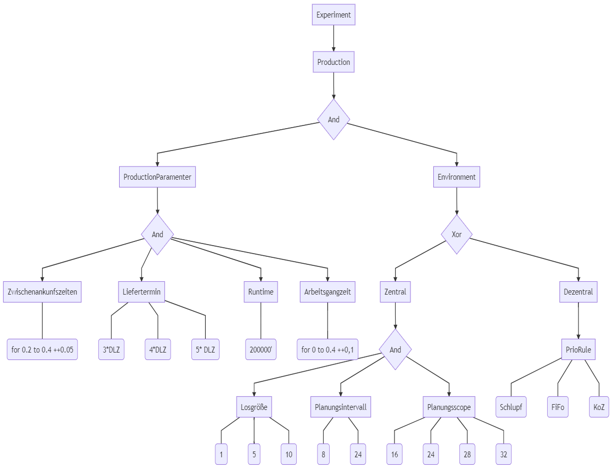

# Einleitung

In diesem Abschnitt befinden sich Anleitungsartikel zur EMS.

## Was sind Faktoren?

Faktoren sind Objekte, die durch Namen und mögliche Wertausprägungen beschrieben werden. Bei den Wertausprägungen wird zunächst zwischen komplexen und atomaren Faktoren unterschieden.

Komplexe Faktoren besitzen als mögliche Wertausprägungen Subfaktoren, diese können wiederum parallel (also zeitgleich) oder alternativ (ein Subfaktor pro Experiment) betrachtet werden.

Atomare Faktoren können ihre Wertausprägungen aus einem diskreten oder kontinuielrichen Wertebereich beziehen.

Außerdem kann ein Faktor aktiviert oder deaktiviert sein. Deaktivierte Faktoren werden für ein Experiment nicht betrachtet.

## Was ist ein Faktorbaum?

Ein Faktorbaum bildet Faktoren in einer Teil-Ganzes-Hierarchie ab, in dieser Struktur stehen die komplexen Faktoren für alle Knoten bis auf die Blattknoten. Blattknoten sind in einem Faktorbaum die atomaren Faktoren mit ihren Wertebereichen.

Ein Faktorbaum hat folgendes Erscheingungsbild:
